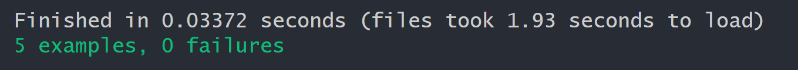

# `The Word definer`
#### *Created By: David Couch*

#### *Makes learning definitions fun!*
* * *
## `Description`
This is an app to make learning fun for children or adults alike! The application can add words to a home page and be clicked on to add definitions to such word. This application fallows CRUD functionality.

## `What is crud functionality?`
From [Wikipedia](https://en.wikipedia.org/wiki/Create,_read,_update_and_delete)\
"In computer programming, create, read, update, and delete are the four basic functions of persistent storage. Alternate words are sometimes used when defining the four basic functions of CRUD, such as retrieve instead of read, modify instead of update, or destroy instead of delete."

## `Concept`
Data can be put in a location (area) of a storage. The fundamental feature of a storage location is that it has a readable and updatable content (state). These read and update operations are the two basic operations on a storage and are known as the load–update pair (LUP).

Before a storage location can be read or updated, it needs to be available. A storage location can be made either available or unavailable for usage. These create and delete operations are the two other basic operations on a storage.

Together they make up the four basic operations of storage management (direct manipulation of the contents of storage locations by users) known as CRUD: create, read, update, and delete. CRUD operations are idempotent, meaning that multiple applications of the same operation have the same effect on a storage as a single application.


* * *

## `Technologies used`

* Ruby
* Rspec
* Sinatra
* Heroku

### Want to see this webpage now? <a href="https://polar-ravine-97022.herokuapp.com/">Visit This Heroku Link</a>

# Load it yourself? Fallow these installation instructions

* Go to ( https://github.com/dcouch440/the-word-definer ).
* Navigate to the code button on the github website.

* Click on the code button to open the menu.

- Copy the HTTPS code by clicking the clipboard next to the link.

- Within your Bash terminal navigate to your desired location by using cd followed by your desired directory.
```bash
 cd Desktop
```

- Once you have chosen your desired directory use the command.
```bash
git clone https://github.com/dcouch440/the-word-definer.git
```

<div
  style="
    background-color: #d1ecf1;
    color: grey; padding: 6px;
    font-size: 9px;
    border-radius: 5px;
    border: 1px solid #d4ecf1;
    margin-bottom: 18px"
>
  <span
    style="
      font-size: 12px;
      font-weight: 600;
      color: #0c5460;"
  >
    ⓘ
  </span>
  <span
    style="
      font-size: 12px;
      font-weight: 900;
      color: #0c5460;
      margin-bottom: 24px"
  >
    Note :
  </span>
  If you have any problems make sure your HTTPS code is correct! The example above might not be the most recent HTTPS code!
</div>


* Then after the process is completed use the command.

``` bash
code .
```

* Then type

``` bash
gem install bundler
```
* then type

``` bash
bundle install
```
* Then from the terminal you can run logical code through the terminal by typing

```bash
ruby app.rb
```

```bash
$ ruby app.rb
== Sinatra (v2.1.0) has taken the stage on 4567 for development with backup from Puma
*** SIGUSR2 not implemented, signal based restart unavailable!
*** SIGUSR1 not implemented, signal based restart unavailable!
*** SIGHUP not implemented, signal based logs reopening unavailable!
Puma starting in single mode...
* Puma version: 5.2.1 (ruby 2.6.6-p146) ("Fettisdagsbulle")
*  Min threads: 0
*  Max threads: 5
*  Environment: development
*          PID: 9432
* Listening on http://[::1]:4567
* Listening on http://127.0.0.1:4567
Use Ctrl-C to stop
```

* If everything works correctly you should see the block of test above. Copy your listening address over to a web browser to view the website.

* ctrl-C to stop server
## `Testing`
* This project was created using **test-driven development** (TDD).

* To view the test suite, open the spec folder and find a the named function you wish to look at.

* To run the test suite yourself and verify program functionality

```bash
rspec
```

* If there is a problem in the code the testing suite will read as such :

<div>
  
</div>

* Follow the examples and read the English that describes what the function should do. If everything is in order you should receive back :
<div>
  
</div>

## Addition comments:
* Created on 3/5/21

## `Gemfile`
```ruby
source 'https://rubygems.org'

gem 'sinatra-contrib'
gem 'sinatra'
gem 'pry'
gem 'rspec'
gem 'capybara'
```

## `config.ru`
```ruby
require('./app')
run Sinatra::Application
```
* * *


## `About Sinatra MVC`
From <a href="https://ivanadokic.github.io/sinatra_mvc_file_structure#:~:text=rb%20file%20represents%20the%20%E2%80%9CC,for%20the%20user%20to%20see.">Ivanadokic</a>\
`General`\
The Models, Views and Controllers will be grouped into a folder named app directory where we spend most of our time coding. All the main files are organized inside an app folder with subfolders corresponding to each component of MVC: models for object model files,views ** for html template files, and **controllers for controller files.

`Models Directory`\
This directory holds the logic behind our application. Typically, these files represent either a component of our application, such as a User, Post, or Comment… Each file in models typically contains a different class.

`Controllers Directory`\
The controllers, such as application_controller.rb, are where the application configurations, routes, and controller actions are implemented. Controllers represent the application logic, generally; the interface and flow of our application. There is typically a class, in this case we will call it ApplicationController, that represents an instance of our application when the server is up and running. The application_controller.rb file represents the “C” components of the MVC paradigm.

`Views Directory`\
This directory holds the code that will be displayed in the browser. By convention, our file names will match up with the action that renders them. For example, a GET request to / typically renders a file called index.erb.

In Sinatra, views are written as .erb files, consisting of HTML and embedded Ruby (Ruby code written within HTML). They are what the user actually sees when they use your web application.

`NOTE:` The information listed is a bit more advanced than what is shown in this application but the fundamental principle of these concepts still represent whats happening under the hood.
* * *
## `Contact Information`
_David Couch: [Email](dcouch440@gmail.com)_
* * *

## `License`
> [GPLv3](https://choosealicense.com/licenses/gpl-3.0/)\
> David Couch &copy; 2021
* * *
